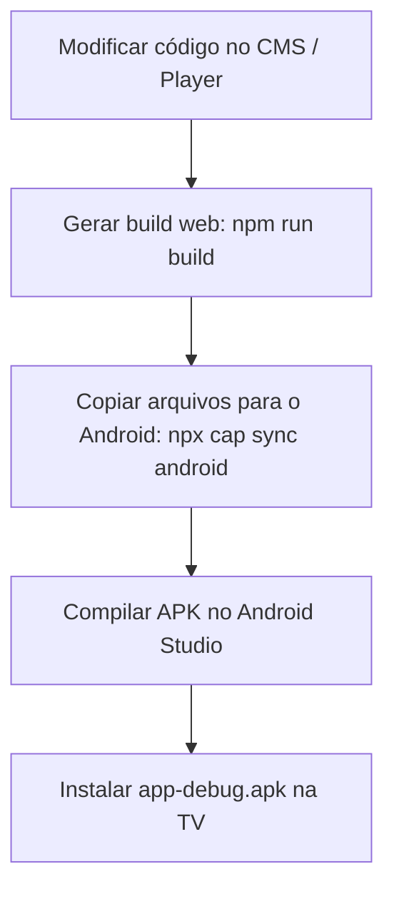

# Manual Técnico do Aplicativo Android (Player TV)

Este documento detalha o funcionamento técnico da camada nativa Android do player de **Mídia Indoor**, explicando a estrutura do projeto, o fluxo do APK, os serviços de inicialização automática e como solucionar problemas/capturar logs.

---

## 1. Arquitetura Geral

O aplicativo é um aplicativo híbrido desenvolvido com **Capacitor** que empacota uma aplicação web moderna (React + Vite).

*   **Camada Web (React):** Roda dentro de uma WebView do Android, gerenciando a busca das mídias no Supabase e a exibição em loop de imagens e vídeos.
*   **Camada Nativa (Java/Android):** Controla o ciclo de vida do dispositivo, impede que a tela desligue, inicializa o app automaticamente ao ligar a TV e força o app a voltar para o primeiro plano caso seja fechado ou minimizado.

---

## 2. Estrutura do Código Nativo

Os arquivos nativos estão localizados no diretório [android/app/src/main](file:///c:/Users/Vinicius/Documents/GitHub/media-indoor-signage/android/app/src/main). Os principais componentes são:

### 2.1 [MainActivity.java](file:///c:/Users/Vinicius/Documents/GitHub/media-indoor-signage/android/app/src/main/java/com/mediaindoorsignage/tv/MainActivity.java)
É a tela principal do app que carrega a WebView. Ela possui as seguintes responsabilidades:
*   **Manter Tela Ligada:** Adiciona a flag `FLAG_KEEP_SCREEN_ON` para evitar que a TV entre em modo de suspensão ou desligue a tela durante a reprodução das mídias.
*   **Ocultar Barras do Sistema:** O método `hideSystemNavigationBar` esconde as barras de status e navegação para garantir exibição em tela cheia (modo Kiosk).
*   **Permissão de Desenho sobre Outros Apps (Overlay):** Solicita permissão para desenhar sobre outras telas (necessário para o serviço de auto-reinicialização). Esta chamada está protegida por um bloco `try-catch` para evitar travamentos em TVs que não possuem essa configuração.
*   **Inicialização do Serviço:** Dispara o serviço em segundo plano [AutoLaunchService](file:///c:/Users/Vinicius/Documents/GitHub/media-indoor-signage/android/app/src/main/java/com/mediaindoorsignage/tv/AutoLaunchService.java) (também protegido contra falhas de segurança do Android 12+).

### 2.2 [AutoLaunchService.java](file:///c:/Users/Vinicius/Documents/GitHub/media-indoor-signage/android/app/src/main/java/com/mediaindoorsignage/tv/AutoLaunchService.java)
É um serviço de segundo plano do tipo **Foreground Service** (Serviço em Primeiro Plano) que monitora o aplicativo:
*   **Monitoramento Ativo:** A cada 10 segundos, verifica se o aplicativo está visível em primeiro plano.
*   **Recuperação de Inatividade:** Se o app for minimizado ou enviado para o background por mais de 30 segundos (limiar configurado em `INACTIVITY_THRESHOLD`), o serviço executa o método `launchMainActivity()` para trazer a interface de reprodução de volta à tela automaticamente.
*   **FullScreen Intent Fallback:** Em versões recentes do Android, trazer um app para a frente a partir do background de forma silenciosa é bloqueado. Como contingência, o serviço dispara uma notificação de alta prioridade com `FullScreenIntent` que força a abertura do player.

### 2.3 [BootReceiver.java](file:///c:/Users/Vinicius/Documents/GitHub/media-indoor-signage/android/app/src/main/java/com/mediaindoorsignage/tv/BootReceiver.java)
Um receptor de transmissões do sistema (Broadcast Receiver) que escuta o evento de inicialização do dispositivo (`BOOT_COMPLETED`, `QUICKBOOT_POWERON`):
*   **Autostart:** Assim que a TV ou Mi Stick é ligado, ele recebe o sinal e abre automaticamente a [MainActivity](file:///c:/Users/Vinicius/Documents/GitHub/media-indoor-signage/android/app/src/main/java/com/mediaindoorsignage/tv/MainActivity.java) e inicia o [AutoLaunchService](file:///c:/Users/Vinicius/Documents/GitHub/media-indoor-signage/android/app/src/main/java/com/mediaindoorsignage/tv/AutoLaunchService.java).

### 2.4 [AndroidManifest.xml](file:///c:/Users/Vinicius/Documents/GitHub/media-indoor-signage/android/app/src/main/AndroidManifest.xml)
Configura todas as declarações e permissões necessárias do sistema:
*   `INTERNET`: Para conectar ao Supabase e baixar mídias.
*   `RECEIVE_BOOT_COMPLETED`: Para o autostart funcionar.
*   `SYSTEM_ALERT_WINDOW`: Permissão para desenhar sobre outras telas.
*   `FOREGROUND_SERVICE` e `FOREGROUND_SERVICE_DATA_SYNC`: Para manter o monitoramento ativo sem ser finalizado pelo sistema operacional.
*   `USE_FULL_SCREEN_INTENT`: Para forçar a abertura por notificação se necessário.

---

## 3. Fluxo de Build do APK

Para atualizar o aplicativo e gerar um novo instalador (APK), siga estas etapas na ordem:



### Passo 1: Build Web
Gera a pasta estática otimizada `dist/` contendo o HTML/CSS/JS compilado (incluindo polyfills de compatibilidade legada).
```bash
npm run build
```

### Passo 2: Sincronização do Capacitor
Copia os arquivos gerados de `dist/` para a pasta de recursos nativos do Android (`android/app/src/main/assets/public`).
```bash
npx cap sync android
```

### Passo 3: Geração do APK
Abra a pasta `android/` no **Android Studio**:
1.  Aguarde o carregamento do Gradle (Gradle Sync).
2.  No menu superior, vá em **Build** ➔ **Build Bundle(s) / APK(s)** ➔ **Build APK(s)**.
3.  Quando finalizado, o Android Studio mostrará um balão de sucesso. Clique no link **"locate"** para abrir a pasta do APK gerado (`app-debug.apk`).

---

## 4. Compatibilidade com WebViews de TV Antigas

A maioria das TVs (como TCL e sticks básicos) rodam versões desatualizadas do Android TV System WebView.
*   **Problema de ES Modules:** O Vite moderno gera código empacotado em módulos Javascript (`<script type="module">`). WebViews antigas ignoram totalmente essas tags, resultando em uma tela preta estática no início do aplicativo.
*   **Solução:** Adicionamos o plugin `@vitejs/plugin-legacy` no [vite.config.ts](file:///c:/Users/Vinicius/Documents/GitHub/media-indoor-signage/vite.config.ts). Ele gera blocos de código redundantes em JS clássico com injeção automática de Polyfills (via script clássico `nomodule`), garantindo compatibilidade com navegadores equivalentes ao Chrome 60+.

---

## 5. Como Diagnosticar Problemas (Captura de Logs)

Se o aplicativo travar ou apresentar problemas na TV, a melhor forma de entender o motivo é olhando os logs do sistema operacional (**Logcat**).

### Método: Android Studio Logcat
1.  Ative as **Opções do Desenvolvedor** e a **Depuração USB/Rede** na sua Android TV/Mi Stick.
2.  No seu computador (na mesma rede Wi-Fi da TV), abra o terminal e digite:
    ```bash
    adb connect <IP_DA_SUA_TV>
    # Exemplo: adb connect 192.168.1.15
    ```
3.  Abra o **Android Studio**.
4.  No canto inferior, selecione a aba **Logcat**.
5.  Selecione o dispositivo da TV na caixa de seleção.
6.  No campo de busca do Logcat, digite: `package:com.mediaindoorsignage.tv` ou apenas `fatal` ou `Exception`.
7.  Inicie o aplicativo na TV. O motivo exato de qualquer encerramento inesperado (Crash) será listado em linhas vermelhas com a descrição detalhada da exceção do Java ou Javascript.
